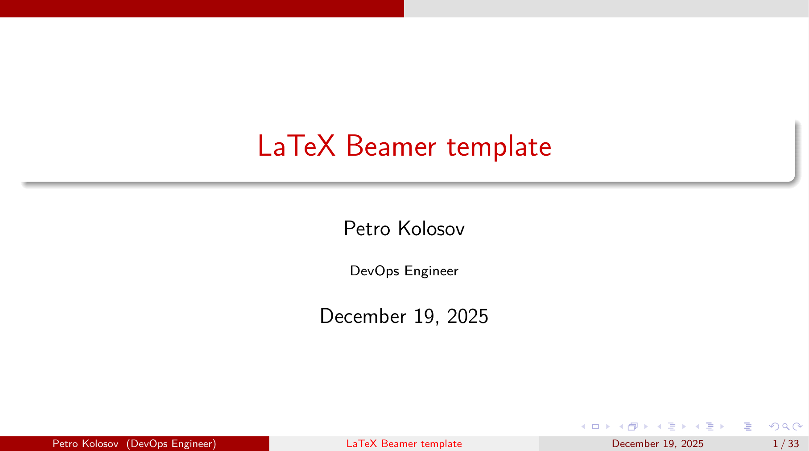
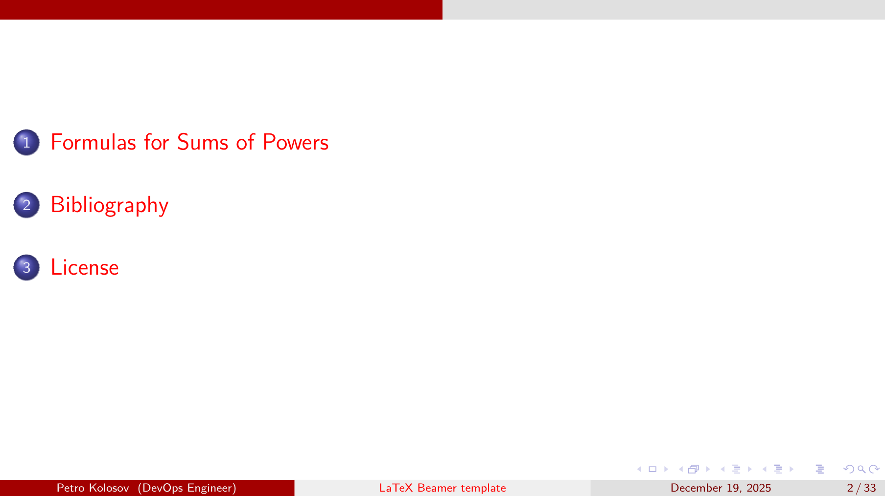

# LaTeX Beamer Presentation Template

- LaTeX Beamer Presentation Template for GitHub including general CI/CD actions and Mathematica templates.
- Best compatible with JetBrains Rider 2024.3.8 Build #RD-243.26574.73, built on May 18, 2025.
- Plugin: https://plugins.jetbrains.com/plugin/9473-texify-idea

## GitHub Actions used

- https://github.com/actions/checkout
- https://github.com/GitTools/actions/blob/main/docs/examples/github/gitversion/index.md
- https://github.com/xu-cheng/latex-action
- https://github.com/actions/upload-artifact

## Build and run using PowerShell (Windows)

- Install `MikTeX`: https://miktex.org/download
- Update `MikTeX` packages
- Install `SumatraPDF` viewer: https://www.sumatrapdfreader.org/download-free-pdf-viewer
- `.\src\Initialize-Workspace.ps1` configures workspace, renames files and patches CI/CD values
- `.\src\Build-Latex.ps1` to build LaTeX and BibTeX

## How to use Mathematica package

- Open the package file `GithubLatexTemplateMathematicaPackage.m` in Wolfram Mathematica, I use version 13.0
- Execute the package using `Shift+Enter`
- Open the notebook file `GithubLatexTemplateMathematicaNotebook.nb`
- Execute the line: `Needs["GithubLatexTemplateMathematicaPackage"]`
- Continue your work as desired

## Configure CI / CD

- Update root file name in `build-pdf.yml` and `build-and-deploy-pdf.yml`
- Set repository secrets
    - `GH_ACCESS_TOKEN`: Generate GitHub Personal access token at
      `Settings -> Developer Settings -> Personal access tokens -> Generate mew token`

## Actions and their trigger policy

- `build-pdf.yml` builds project using `TeXLive`. Triggered on `pull_request`, `push` to `develop` branch
- `build-and-deploy-pdf.yml` builds project using `TeXLive` and deploys to `GitHub Pages`. Triggered on `push` to `main`
  branch

## Template example

Compiled document looks like as follows

  
  

